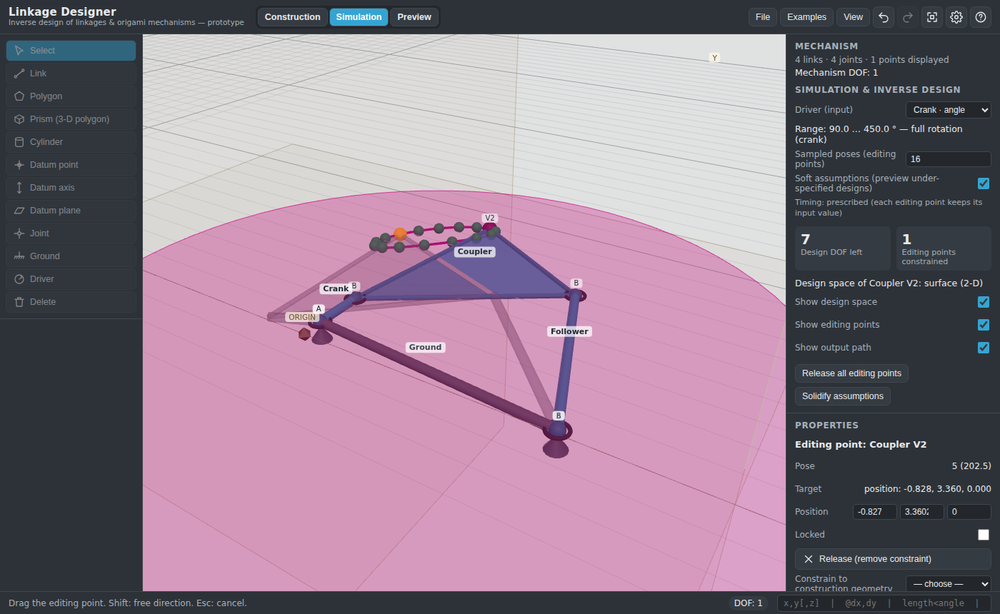

# Linkage Designer

A browser-based, CAD-like prototype for **inverse design of linkages and 3-D
origami mechanisms**: build a mechanism from links, joints and construction
geometry, see its degrees of freedom live, and then drag the *editing points*
along an output path — the solver changes the link geometry so the mechanism
reaches what you drew.



- `docs/ORIGINAL_SPEC.md` — the brief this prototype implements, verbatim.
- `docs/SPEC.md` — detailed specification of every implemented feature, with
  deviations from the brief called out.
- `docs/DESIGN_DECISIONS.md` — assumptions, implementation decisions and the
  research / textbook references behind them.
- `docs/CONSTRUCTION_PLAN.md` — diagnosis of the "four triangles cannot form
  an origami vertex" report, the options weighed and the phased plan (Phases
  0–1, robust joining and folding, are implemented in v0.3 and Phase 2, the
  construction workflow — right-click query pick, the Panel tool's sector
  feedback, 3-D placement on the sketch plane, the crease-pattern validator —
  in v0.4; Phase 3, crease-pattern-first, is planned).

## Running

```bash
npm install
npm run dev        # http://localhost:5173
npm test           # solver / kinematics / synthesis / joining / folding / picking / sketching / validator unit tests (vitest)
npm run build      # type-check + production build into dist/
node scripts/smoke.mjs            # headless-browser smoke test of the built app (needs Playwright's Chromium)
node scripts/smoke-features.mjs   # same for the Panel / Polygon / Edit / Pattern tools, the query cycle, 3-D placement, the model tree and the origami workflow
```

Node 22 is assumed (`.nvmrc`). The built app is static and can be served from
any path (GitHub Pages workflow included in `.github/workflows/ci.yml`).

## Quick tour

1. **Construction mode.** Pick *Link* (`2`), click two points: they land
   where the pointer ray meets the sketch plane, and *Place on sketch plane
   (2-D)* decides whether the link is kept there. Click an existing link end
   to join the new link to it with a pin (revolute). Or type `3<45` in the
   coordinate box for a 3-unit link at 45°. *Panel (sketch polygon)* (`S`)
   builds origami panel by panel: click vertices, and every vertex placed on
   an existing vertex (snapped or typed) is joined when the panel closes —
   panels that share an edge become **creases**, drawn red / blue for
   mountain / valley once folded — while a label at each shared vertex shows
   the running sector-angle sum (green when the last panel closes the ring at
   360°, red when the panels cannot lie flat). *Polygon* (`3`) and *Prism*
   (`4`) join their coincident vertices the same way, and *Extrude* in
   Properties makes prisms. Where edges or vertices coincide, **right-click**
   (without dragging) cycles through everything under the pointer and the
   status bar counts the candidates; a left-click then uses the highlighted
   one with any tool. *Joint* (`J`) connects two features of different links;
   a joint that the existing constraints cannot satisfy is refused and the
   status bar explains why (edges of different length, panel corners that do
   not add up to 360°, a loop that only closes out of the sketch plane) —
   nothing moves and nothing is recorded. *Edit points* (`E`) snaps vertices
   onto other geometry. `Ctrl+C`/`Ctrl+V`, *Mirror* (`M`) and *Pattern* (`P`)
   duplicate links. Pick *Ground* (`G`) and click a link to fix it. The DOF
   chip and the model tree update after every edit.
2. **Origami vertices.** Panels drawn in 2-D mode are kept on the sketch
   plane (*Keep on sketch plane (2-D)* in Properties), so a flat vertex
   reports DOF 0 and the Mechanism panel says which creases that locks. The
   panel's **Crease pattern** block checks every closed vertex: developable
   (sectors sum to 360°), Kawasaki (alternating sum 0°) and, once folded,
   Maekawa (mountains and valleys differ by two). A flat vertex is also a
   singular state in which a simulation folds only two creases: press
   **Fold** in the Mechanism panel before simulating; it releases the panels
   from the plane and pre-folds every crease. A crease's Properties offer
   *Mountain / valley*, *Fold to target* and *Drive this crease*.
3. Select a vertex and tick **Show output path & design space** in the
   Properties panel (the examples already do this).
4. **Simulation mode.** The output path appears with green editing points and
   the magenta design space. Drag an editing point: it turns red, the mechanism
   adapts, and *Design DOF left* drops. Lock points or constrain them to a
   datum in Properties. Toggle *Soft assumptions* to hide the preview until the
   design is fully specified.
5. **Preview mode.** Play the motion through the driver's range.
6. *File → Save* writes a `.linkage.json` with the solidified design (a pose
   that violates the constraints is saved as it is, and the status bar says
   so).

Mouse: left-click picks, right-click (no drag) cycles through the features
under the pointer, right-drag orbits, middle-drag pans, wheel zooms. Keys:
`1` select, `2` link, `3` polygon, `4` prism, `5` cylinder, `S` panel, `E`
edit, `J` joint, `G` ground, `D` driver, `M` mirror, `P` pattern, `F` zoom to
fit, `Enter` closes a panel, `Backspace` removes its last vertex, `Esc` ends
the query cycle or cancels the tool, `Del` deletes, `Ctrl+Z` / `Ctrl+Y` undo
/ redo. See `docs/SPEC.md` §1 for the full list; `?` in the top bar shows
quick help.

## Project layout

```
src/core/        solver and mechanism model (no DOM / three.js)
  types.ts         data model
  constraints.ts   residuals + Jacobians (distance, coincidence, plane, line, angle, dihedral, screw, …)
  model.ts         creation/editing of links, joints, datums, drivers
  compile.ts       model → solver system (point merging, frozen coordinates, poses)
  solver.ts        Levenberg–Marquardt, dense Cholesky, pivoted QR (rank / null space)
  kinematics.ts    forward solve, mobility, driver sweeps, output surfaces
  synthesis.ts     stacked multi-pose inverse design, design DOF, design space
  examples.ts      built-in example mechanisms
  edit.ts          vertex editing, sketch-plane fitting, automatic joining of coincident vertices
  patterns.ts      copy / mirror / array patterning, extrusion
  jointMeasure.ts  fold (dihedral) and slide measurement of joints
  feasibility.ts   pre-flight solve, rollback and diagnoses for construction edits; consistency guard
  fold.ts          creases, crease loops, mountain / valley, the Fold (pre-fold) command
  sector.ts        running sector-angle sums at shared vertices for the Panel tool (labels, overlap refusal)
  validate.ts      crease-pattern validator (developability, Kawasaki, Maekawa per interior vertex)
src/viewport/    three.js scene, renderer and interactive tools
  pickRank.ts      pick results and their ranking for the query cycle (DOM-free)
  pickCycle.ts     the right-click query cycle state machine (DOM-free)
src/ui/          strings (all UI text), settings + colour maths, panels, colour picker, icons, joint labels
tests/           vitest unit tests
examples/        example mechanism files
docs/            specification and design notes
```

## Status

Prototype. Mechanisms with up to a few hundred solver variables are
interactive; see `docs/DESIGN_DECISIONS.md` §9 for known limitations.
